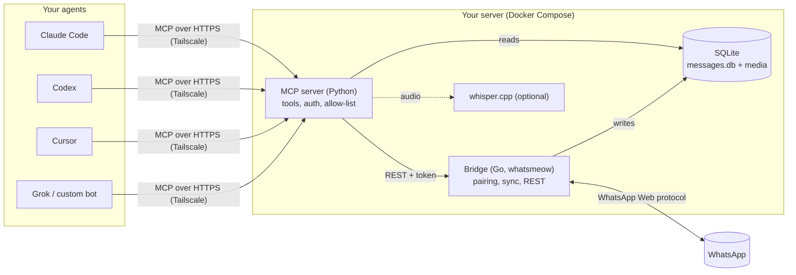

# WhatsApp MCP: give your AI agent a WhatsApp account

**Self-hosted WhatsApp for Claude Code, Codex, Cursor, Claude Desktop and your own bots, over the Model Context Protocol.** Read and search your chats, reply, send files and voice notes, transcribe audio, tally polls. Runs 24/7 in two containers on a home server or VPS; your agents reach it from anywhere over Tailscale. No cloud API, no WhatsApp Business account, no message ever leaves your machine unless you ask.

[](https://github.com/Tauri-EPO/whatsapp-mcp/actions/workflows/ci.yml)
[](https://opensource.org/licenses/MIT)
[](https://modelcontextprotocol.io/)
[](docs/DOCKER.md)

<p align="center">
  <a href="https://github.com/user-attachments/assets/9475af1d-2369-4315-9ccc-823dba2c5c32"><strong>Watch the demo video</strong></a>
  <br/><sub>Product demo generated with Remotion using simulated data.</sub>
</p>

## Is this for you?

- **You live in Claude Code, Codex or Cursor** and want to say "answer João about the invoice" or "what did the family group decide about Sunday?" without leaving the terminal.
- **You run a bot** (Grok, OpenAI Agents SDK, LangChain, anything that speaks MCP) and need it to read and write WhatsApp on your personal number, from a server you control.
- **You want your WhatsApp history searchable by an LLM**, locally, with full-text search, voice notes transcribed, and media kept on your disk.
- **You are careful.** You want a bearer token in front, an allow-list of the chats the agent may touch, and nothing sent to a third party.

If that sounds like you, the [60-second start](#60-second-start) below gets you a paired, running server. Connecting your client is one command.

## What your agent can do

| | |
| --- | --- |
| **Read** | list chats, list and page through messages (by direction, media kind, groups or not), unread summary across chats, the conversations still waiting for your reply, full-text search across everything, message context around a hit, contacts by name or number |
| **Triage** | `mentions_me` finds what actually addressed you — WhatsApp writes a mention as an internal ID, not as your name — and `list_unanswered(include_group_mentions=True)` puts the group questions nobody answered next to the direct chats waiting on you |
| **Count** | `message_stats` aggregates messages per chat, day, month or sender, so the agent can size a job or answer "who talks most" without reading the archive; the bulk reads also take `count_only` |
| **Compact** | those reads take `fields`, `omit_nulls` and `max_content_chars`: a 500-message page goes from 270 KB to 155 KB by dropping the null columns, to 65 KB with three fields — the same conversation, a fraction of the context |
| **Export** | `export_messages` streams a whole archive to NDJSON on disk and hands back a path, not the rows — bulk analysis without paying for it in context |
| **Write** | send text, reply with quote, mention people, react, edit, forward, mark as read, show "typing", delete for everyone or locally; `dry_run` on the send tools returns the exact payload without sending, for an assistant that drafts while you approve |
| **Media** | send files and voice notes (auto-converted to Opus), `read_media` returns the bytes to the agent itself — images as image content, voice notes as audio, everything else as a resource carrying the file's real MIME type, and PDF/DOCX/XLSX extracted to text on the server — so a client on another machine can actually read the attachment; every file is also an MCP resource (`whatsapp://media/…`, linked from each `list_media` row) for a client that would rather fetch bytes on its own terms, recover expired attachments by asking the sender's phone, inventory of what is stored (size, duplicates across chats, cached or not), free space on request with a dry run first |
| **Audio** | transcribe voice notes with a local whisper.cpp (Portuguese by default, any language); transcripts are cached in the agent's notes, surfaced inline in message lists, and matched by full-text search; `TRANSCRIBE_ON_INGEST=1` transcribes inbound voice notes in the background as they arrive |
| **Triage** | `mark_handled` and `snooze` record what a reply pass decided, so the next `list_unanswered` returns what is left instead of the same 300 chats — nothing is sent, nothing the other side can see, and a new message from them brings the chat straight back |
| **Groups and polls** | group members, add/remove/promote members, rename, invite link, leave, native poll results with every voter's choice |
| **Memory** | deleted messages keep their content, view-once media is archived without consuming the phone's view, calls are logged, and the agent keeps its own notes across sessions — about files, chats, contacts and individual messages (label, importance, summary, a dated log), returned inline wherever the target is listed, versioned so a rewrite never loses what it replaced |
| **Self-check** | `bridge_status` tells the agent whether the bridge is paired and connected before it blames an empty result; `coverage` shows what the archive really holds and which periods are missing; `request_history` asks the phone to backfill a chat whose archive starts too late |

The full list with parameters is in [docs/TOOLS.md](docs/TOOLS.md).

## 60-second start

Needs Docker with Compose v2 and a phone with WhatsApp. x86 and ARM hosts both work for the bridge and MCP images; the optional whisper image depends on the upstream tag supporting your architecture.

```bash
git clone https://github.com/Tauri-EPO/whatsapp-mcp.git
cd whatsapp-mcp
cp .env.example .env                      # set WHATSAPP_BRIDGE_TOKEN, WHATSAPP_ALLOWED_CHATS (recommended)
GIT_SHA=$(git rev-parse --short HEAD) docker compose up -d --build
docker compose logs -f bridge             # scan the QR code with WhatsApp > Linked Devices
scripts/smoke.sh                          # health, readiness, token and MCP handshake in one go
```

That is the whole install. The bridge pairs as a linked device (like WhatsApp Web), stores messages in SQLite inside a Docker volume, and the MCP endpoint answers at `http://127.0.0.1:8000/mcp`. Restarts and updates never need a new QR.

Prefer a laptop process launched by your editor instead of containers? See [docs/LAPTOP.md](docs/LAPTOP.md). Prefer not to compile on the server? Ready-made images are on GHCR: `latest` is the last [release](https://github.com/Tauri-EPO/whatsapp-mcp/releases), `main` the edge; `docker compose pull && docker compose up -d` uses them ([docs/DOCKER.md](docs/DOCKER.md#published-images)).

## Connect your agent

The endpoint is **streamable HTTP** at `/mcp`, protected by a bearer token (the bridge token by default, or `WHATSAPP_MCP_TOKEN`). Replace `TOKEN` and the URL below; on the same machine the URL is `http://127.0.0.1:8000/mcp`.

**Claude Code**

```bash
claude mcp add --transport http whatsapp https://box.tailnet.ts.net/mcp \
  --header "Authorization: Bearer TOKEN"
```

**Codex CLI / Codex desktop** (`~/.codex/config.toml`)

```toml
[mcp_servers.whatsapp]
url = "https://box.tailnet.ts.net/mcp"
bearer_token_env_var = "WHATSAPP_MCP_TOKEN"   # export WHATSAPP_MCP_TOKEN=TOKEN
```

**Cursor** (`~/.cursor/mcp.json`)

```json
{
  "mcpServers": {
    "whatsapp": {
      "url": "https://box.tailnet.ts.net/mcp",
      "headers": { "Authorization": "Bearer TOKEN" }
    }
  }
}
```

**Claude Desktop**: Settings > Connectors > Add custom connector with the same URL, or launch the server locally over stdio as in [docs/LAPTOP.md](docs/LAPTOP.md).

**Your own bot** (Grok, OpenAI Agents SDK, LangChain, a Python script): any MCP client that supports streamable HTTP. With the `mcp` Python SDK (v2):

```python
import httpx2  # the SDK v2's HTTP client (pip install "mcp[cli]" brings it)
from mcp.client import Client
from mcp.client.streamable_http import streamable_http_client

transport = streamable_http_client(
    "https://box.tailnet.ts.net/mcp",
    http_client=httpx2.AsyncClient(headers={"Authorization": "Bearer TOKEN"}),
)
async with Client(transport) as client:
    chats = await client.call_tool("list_chats", {"limit": 5})
```

**Sanity check with curl**

```bash
curl -s -H "Authorization: Bearer TOKEN" -H 'Accept: application/json, text/event-stream' \
  -H 'Content-Type: application/json' https://box.tailnet.ts.net/mcp \
  -d '{"jsonrpc":"2.0","id":1,"method":"initialize","params":{"protocolVersion":"2025-03-26","capabilities":{},"clientInfo":{"name":"curl","version":"0"}}}'
```

A `200` with an `mcp-session-id` header means you are in. `401` is a missing or wrong token; `421` means the hostname is not in `WHATSAPP_MCP_ALLOWED_HOSTS`.

## Reach it from anywhere, safely

The MCP port is published on `127.0.0.1` only. The intended way to reach it from another machine is Tailscale:

```bash
sudo tailscale serve --bg --https=443 http://127.0.0.1:8000     # tailnet-only HTTPS
```

and `WHATSAPP_MCP_ALLOWED_HOSTS=box.tailnet.ts.net` in `.env`. A hosted bot outside your tailnet can use Tailscale Funnel with the bearer token enforced. Details, including a reverse-proxy alternative, are in [docs/DOCKER.md](docs/DOCKER.md).

What protects your account:

- **One secret.** The bridge generates a 256-bit token on first run; the MCP endpoint reuses it. Rotate it in `.env`.
- **Allow-list of chats.** `WHATSAPP_ALLOWED_CHATS=5511999999999,*@g.us` means the agent can only see and touch those conversations. Enforced twice: by the MCP server on every tool and by the bridge on every outbound call.
- **Loopback and Host checks by default**, rate limit and body cap on the HTTP endpoint, media sends confined to an outbox directory.
- **Nothing leaves the box.** Messages, media and transcripts stay in a Docker volume. Transcription is local whisper.cpp; there is no cloud fallback on purpose.
- **Read-only mode.** `WHATSAPP_READ_ONLY=1` removes every mutating tool from `tools/list` (and 403s the matching bridge endpoints), so an assistant that reads and drafts has nothing to send with. Recommended default; see [docs/CONFIGURATION.md](docs/CONFIGURATION.md#read-only-mode-recommended-for-a-personal-assistant).
- **Per-tool allow and deny lists.** `WHATSAPP_ALLOW_TOOLS` / `WHATSAPP_DENY_TOOLS` grant exactly the operations you want ("read everything, react, never delete"), enforced by the MCP server on `tools/list` and by the bridge on the endpoints those tools call. Deny wins over allow, read-only wins over both.
- **Prompt injection is real.** An agent that reads untrusted messages and can send messages is [the lethal trifecta](https://simonwillison.net/2025/Jun/16/the-lethal-trifecta/). Every tool that returns message content tells the model that it is third-party data, never instructions, and `WHATSAPP_WRAP_UNTRUSTED=1` adds explicit delimiters around it. Those are hints; the controls are the allow-list, read-only mode and the tool lists above. See [SECURITY.md](SECURITY.md).

## Configuration essentials

Everything is an environment variable in `.env`. The ones that matter on day one:

| Variable | Why |
| --- | --- |
| `WHATSAPP_BRIDGE_TOKEN` | Set your own (32+ random chars) so bridge, MCP and clients share one known secret. Otherwise copy the generated one from the bridge log |
| `WHATSAPP_ALLOWED_CHATS` | Which chats the agent may read and write. Start narrow |
| `WHATSAPP_READ_ONLY` | `1` hides and refuses every mutating tool (read-and-draft assistant). Set it for both services |
| `WHATSAPP_MCP_ALLOWED_HOSTS` | The hostname clients use (your MagicDNS name) so DNS-rebinding protection stays on |
| `WHATSAPP_DEVICE_NAME` | Label under Linked Devices. Pair-time only |
| `WHISPER_URL` + `COMPOSE_PROFILES=whisper` | Turn on local voice-note transcription (`WHISPER_MODEL_NAME=small` is a good CPU default); add `TRANSCRIBE_ON_INGEST=1` to transcribe voice notes as they arrive |
| `WHATSAPP_MEDIA_RETENTION_DAYS` | Cap disk use on a small server; files are re-fetched on demand |
| `WHATSAPP_LOG_LEVEL` | `INFO` by default. `DEBUG` echoes message content into the logs |

The complete reference (every variable, transports, auth semantics, history backfill, CLI flags) is [docs/CONFIGURATION.md](docs/CONFIGURATION.md). Container operations (pairing, health, updates, hot backups with `scripts/backup.sh`, split topologies) are [docs/DOCKER.md](docs/DOCKER.md).

## How it works



Two processes: a Go bridge that is a WhatsApp linked device (via [whatsmeow](https://github.com/tulir/whatsmeow)) and owns the database, and a Python MCP server that answers your agent from the database and calls the bridge only to act. Reads never touch WhatsApp, so they are fast and work offline. More diagrams in [docs/ARCHITECTURE.md](docs/ARCHITECTURE.md); the file-by-file map for contributors is in [AGENTS.md](AGENTS.md).

## Why this fork

This repository descends from [lharries/whatsapp-mcp](https://github.com/lharries/whatsapp-mcp) through [verygoodplugins/whatsapp-mcp](https://github.com/verygoodplugins/whatsapp-mcp). Upstream targets a developer laptop talking to Claude Desktop over stdio. This fork targets an always-on box shared by remote agents, and has diverged into a hard fork (no more upstream merges; upstream is harvested for ideas, credited in commits).

| | Upstream | This fork |
| --- | --- | --- |
| Deployment | `go run` + `uv run` on a laptop | Docker Compose, health/readiness endpoints, build identity, media retention |
| Remote access | loopback only; non-loopback answered 421 | streamable HTTP with Host allow-list, bearer token, rate limit; Tailscale-first |
| Safety | bridge token | one shared token, `WHATSAPP_ALLOWED_CHATS`, read-only mode and per-tool allow/deny enforced in both processes, `dry_run` sends, untrusted-content marking, single-instance lock |
| Search and data | `LIKE` scan | SQLite FTS5 (transcripts included), polls, deleted and view-once content kept, unread and unanswered views, direction/media filters, compact and count-only reads, `message_stats`, NDJSON export, archive coverage report, on-demand history backfill |
| Audio | out of scope | `transcribe_audio` with local whisper.cpp, cached transcripts, optional background transcription on arrival |
| Code | one 4k-line `main.go`, globals | `Bridge` struct, one file per responsibility, staticcheck/gosec/CodeQL, image build in CI |
| Releases | release-please, tags + CHANGELOG | release-please too: automatic semantic versions, a release cut once a day when there is something to ship, GitHub Releases, `latest` / `vX.Y.Z` images on GHCR; `main` stays deployable between releases |

The full comparison and the reasoning are in [AGENTS.md](AGENTS.md) section 2.

## Documentation

- [docs/DOCKER.md](docs/DOCKER.md): pairing, Tailscale and Funnel, health, updates, backups, split topology
- [docs/TOOLS.md](docs/TOOLS.md): every tool with parameters
- [docs/CONFIGURATION.md](docs/CONFIGURATION.md): every variable, transports, auth, allow-list, history backfill
- [docs/LAPTOP.md](docs/LAPTOP.md): stdio setup for Claude Desktop / Cursor, Windows notes
- [docs/TROUBLESHOOTING.md](docs/TROUBLESHOOTING.md): pairing, 401/403/421, sync, app-state conflicts
- [docs/ARCHITECTURE.md](docs/ARCHITECTURE.md): diagrams
- [AGENTS.md](AGENTS.md): how this repo is developed (by humans and AI agents), routine, gotchas
- [CONTRIBUTING.md](CONTRIBUTING.md): tests, lint, PR rules

## Contributing

Issues and PRs live at [Tauri-EPO/whatsapp-mcp](https://github.com/Tauri-EPO/whatsapp-mcp). One problem per issue, one concern per PR, tests and docs in the same PR, CI green before merge. The hardening epics ([#138](https://github.com/Tauri-EPO/whatsapp-mcp/issues/138), [#99](https://github.com/Tauri-EPO/whatsapp-mcp/issues/99)) and the agent-facing API round of September 2026 are done; what is next is the [open issue list](https://github.com/Tauri-EPO/whatsapp-mcp/issues). Read [AGENTS.md](AGENTS.md) first; it is written for AI coding agents as much as for people.

## License and credits

MIT, see [LICENSE](LICENSE).

Created by [Luke Harries](https://github.com/lharries), maintained and extended by [Very Good Plugins](https://verygoodplugins.com/?utm_source=github) (call capture, LID resolution, full-history flag, webhook, CI, among many others by [@edmenendez](https://github.com/edmenendez), [@davidsimoes](https://github.com/davidsimoes), [@davidggphy](https://github.com/davidggphy), [@maikol-solis](https://github.com/maikol-solis), [@DeetBot](https://github.com/DeetBot)), and forked here by [Tauri-EPO](https://github.com/Tauri-EPO) for the always-on, multi-agent use case. Built on [whatsmeow](https://github.com/tulir/whatsmeow), the [MCP Python SDK](https://github.com/modelcontextprotocol/python-sdk) and [whisper.cpp](https://github.com/ggml-org/whisper.cpp).

WhatsApp is a trademark of Meta. This project is not affiliated with or endorsed by Meta; it uses the linked-device protocol like WhatsApp Web, and automation on a personal account is subject to WhatsApp's terms.
