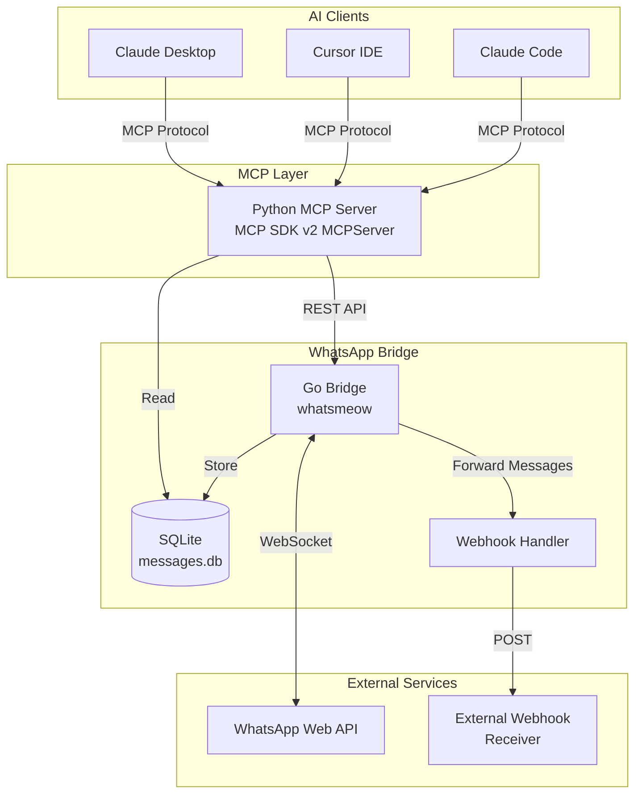
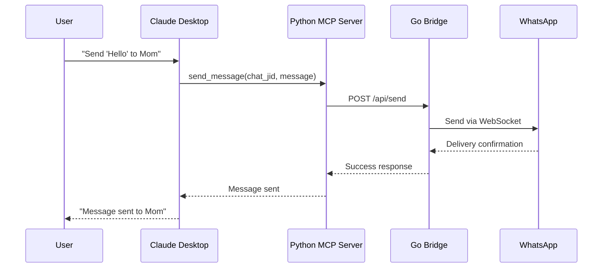
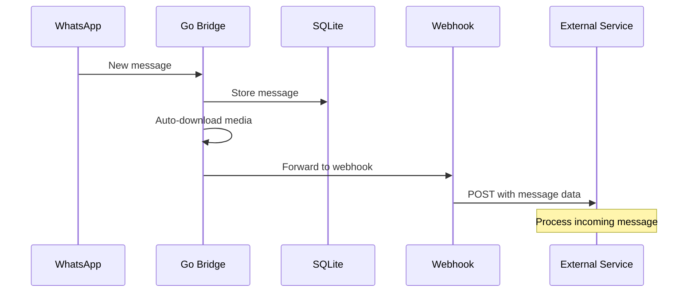

# Architecture

Two processes, two SQLite files, one REST hop. `AGENTS.md` section 3 has the file-by-file map for contributors; this page is the diagram version.



## Component Details

```mermaid
flowchart LR
    subgraph GoAPI["Go Bridge REST API"]
        direction TB
        SEND["/api/send"]
        READ["/api/mark-read"]
        DOWN["/api/download"]
        REACT["/api/react"]
        TYPE["/api/typing"]
        HIST["/api/history"]
        HEALTH["/api/health, /api/ready, /api/version"]
    end

    subgraph MCPTools["MCP Tools (15 total)"]
        direction TB
        CONT["Contact Tools<br/>search_contacts, get_contact"]
        MSG["Message Tools<br/>list_messages, send_message, etc."]
        CHAT["Chat Tools<br/>list_chats, get_chat, etc."]
        MEDIA["Media Tools<br/>send_file, download_media, etc."]
    end

    MCPTools -->|HTTP Requests| GoAPI
```



## Data Flow



## Incoming Message Flow



## Timestamps in `messages.db`

Every time column the bridge writes — `messages.timestamp`, `messages.deleted_at`, `chats.last_message_time`, `chats.last_read_time`, `calls.timestamp`, `calls.ended_at`, `polls.created_at`, `poll_votes.voted_at`, `group_members.first_seen`, `group_members.last_seen` — holds one spelling:

```
YYYY-MM-DD HH:MM:SS+00:00        e.g. 2026-09-07 20:10:08+00:00
```

UTC, second resolution, explicit offset, fixed width. SQLite has no date type, so these are TEXT, and the same offset on every row is what makes `ORDER BY timestamp` and `timestamp > ?` compare instants rather than wall clocks — and what lets a bound value seek the index instead of forcing a scan.

Earlier releases bound a `time.Time` and let the SQLite driver render it, which stamped the writing machine's local offset on the row (older stores also hold Go's `time.Time.String()` form). The bridge rewrites those rows to the canonical spelling on startup, logs how many it changed per column, and stamps `PRAGMA user_version` so the rewrite runs once.

Two things this note does *not* cover: `chats.ephemeral_setting_timestamp` is an INTEGER of WhatsApp seconds, not a time string; and cached media file names keep the *local* wall clock of the message (`<type>_<yyyymmdd_hhmmss>_<id>`), so existing files stay reachable.
