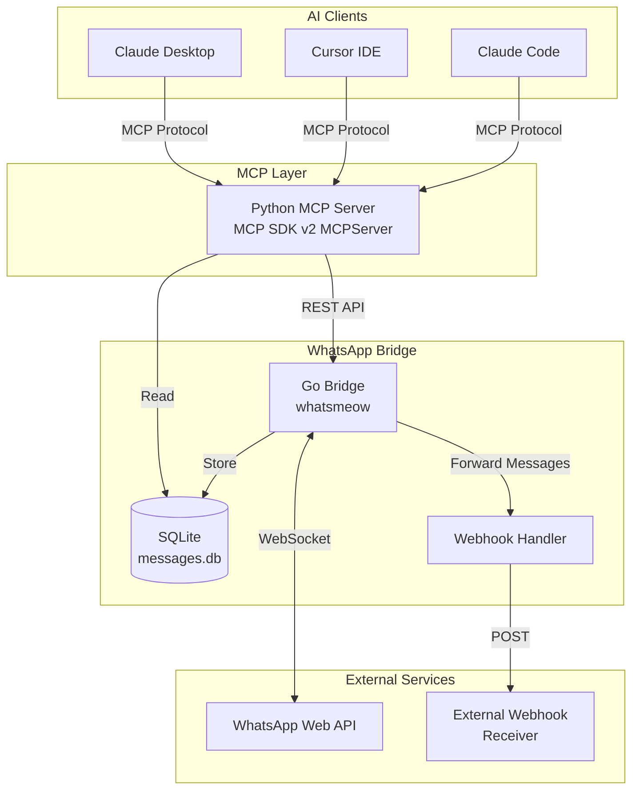
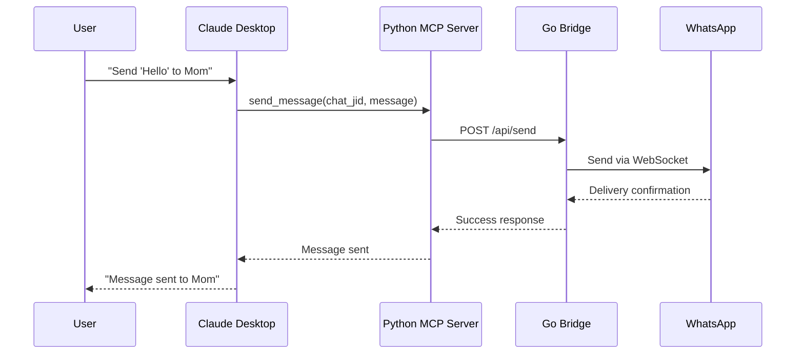
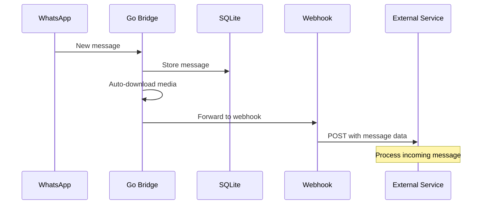

# Architecture

Two processes, two SQLite files, one REST hop. `AGENTS.md` section 3 has the file-by-file map for contributors; this page is the diagram version.



## Component Details

```mermaid
flowchart LR
    subgraph GoAPI["Go Bridge REST API"]
        direction TB
        SEND["/api/send"]
        READ["/api/mark-read"]
        DOWN["/api/download"]
        REACT["/api/react"]
        TYPE["/api/typing"]
        HIST["/api/history"]
        HEALTH["/api/health, /api/ready, /api/version"]
    end

    subgraph MCPTools["MCP Tools (15 total)"]
        direction TB
        CONT["Contact Tools<br/>search_contacts, get_contact"]
        MSG["Message Tools<br/>list_messages, send_message, etc."]
        CHAT["Chat Tools<br/>list_chats, get_chat, etc."]
        MEDIA["Media Tools<br/>send_file, download_media, etc."]
    end

    MCPTools -->|HTTP Requests| GoAPI
```



The MCP server also serves one **resource** template, `whatsapp://media/{chat_jid}/{message_id}` (both halves percent-encoded): the bytes of one attachment, so a client can fetch a file it saw in a `list_media` row without spending a tool call on it. `resources/read` passes the same gates as `read_media` — chat allow-list, message row, size cap, path proven inside that chat's own media directory, implicit-download policy — see [TOOLS.md](TOOLS.md#reading-media-whatsappmedia).

## Data Flow



## Incoming Message Flow



### The automatic media download budget

Storing the message row always happens first and never waits for a file. Caching the media is background work with a fixed budget: **four downloads at a time, up to 256 messages waiting**, each bounded by a ten-minute timeout. Shutdown cancels the transfers in flight, discards the backlog and waits for the workers, so a burst of photos can neither open a hundred simultaneous transfers nor keep writing while the databases close.

When the queue is full the arriving message is dropped, not delayed: the bridge logs `Auto-download queue full …` (WARN) and counts it in `whatsapp_bridge_media_autodownload_drops_total`, next to the `whatsapp_bridge_media_autodownload_queued` and `_running` gauges on `/metrics`. Nothing is lost — the message and its media keys are in `messages.db`, so `download_media` (`POST /api/download`) still fetches that file whenever it is actually needed. `WHATSAPP_MEDIA_AUTODOWNLOAD=false` turns the caching off entirely, and `WHATSAPP_MEDIA_MAX_BYTES` still skips files above its threshold before they ever reach the queue.

### The store root

The bridge opens `WHATSAPP_STORE_DIR` once at startup as an [`os.Root`](https://pkg.go.dev/os#Root) and keeps the handle for its whole life. Everything that walks, measures or deletes inside the store — the retention sweep, the `store_bytes` / `media_bytes` measurement behind `/api/health`, `POST /api/media/purge` — goes through that handle, so the kernel resolves each path component inside the directory and refuses any that leaves it. A symlink planted in a chat directory (or one swapped in between the check and the delete) makes the operation fail instead of reaching another file; the databases, the token and the lock at the store root are still skipped by name, as before.

The rule applies to symlinks an operator put there on purpose too. If a chat directory (`store/<chat_jid>/`) is a symlink onto another disk, downloads still write and serve those files, but the sweep skips them and `/api/media/purge` answers `cached path does not resolve inside the store directory` instead of deleting them. Mount the other disk at the chat directory — or move the whole store with `WHATSAPP_STORE_DIR` — rather than linking into it.

## Timestamps in `messages.db`

Every time column the bridge writes — `messages.timestamp`, `messages.deleted_at`, `chats.last_message_time`, `chats.last_read_time`, `calls.timestamp`, `calls.ended_at`, `polls.created_at`, `poll_votes.voted_at`, `group_members.first_seen`, `group_members.last_seen` — holds one spelling:

```
YYYY-MM-DD HH:MM:SS+00:00        e.g. 2026-09-07 20:10:08+00:00
```

UTC, second resolution, explicit offset, fixed width. SQLite has no date type, so these are TEXT, and the same offset on every row is what makes `ORDER BY timestamp` and `timestamp > ?` compare instants rather than wall clocks — and what lets a bound value seek the index instead of forcing a scan.

Earlier releases bound a `time.Time` and let the SQLite driver render it, which stamped the writing machine's local offset on the row (older stores also hold Go's `time.Time.String()` form). The bridge rewrites those rows to the canonical spelling on startup, logs how many it changed per column, and stamps `PRAGMA user_version` so the rewrite runs once. The stamp is not the whole story: a stamped store still gets one `LIMIT 1` probe per time column at every start, so rows an older binary wrote during an image rollback are repaired on the way forward ([TROUBLESHOOTING.md](TROUBLESHOOTING.md)).

Two things this note does *not* cover: `chats.ephemeral_setting_timestamp` is an INTEGER of WhatsApp seconds, not a time string; and cached media file names keep the *local* wall clock of the message (`<type>_<yyyymmdd_hhmmss>_<id>`), so existing files stay reachable.
