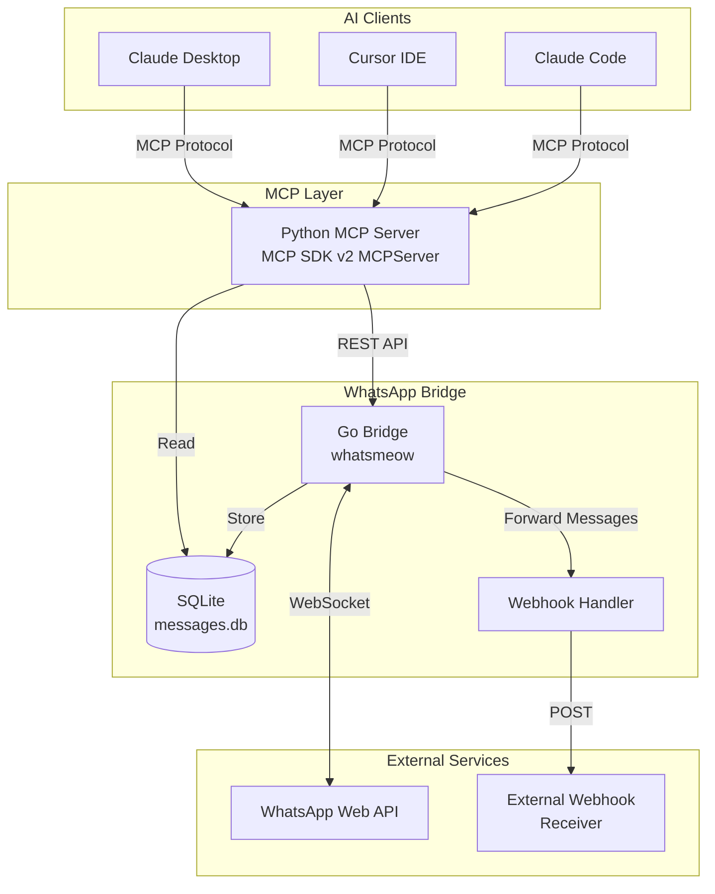
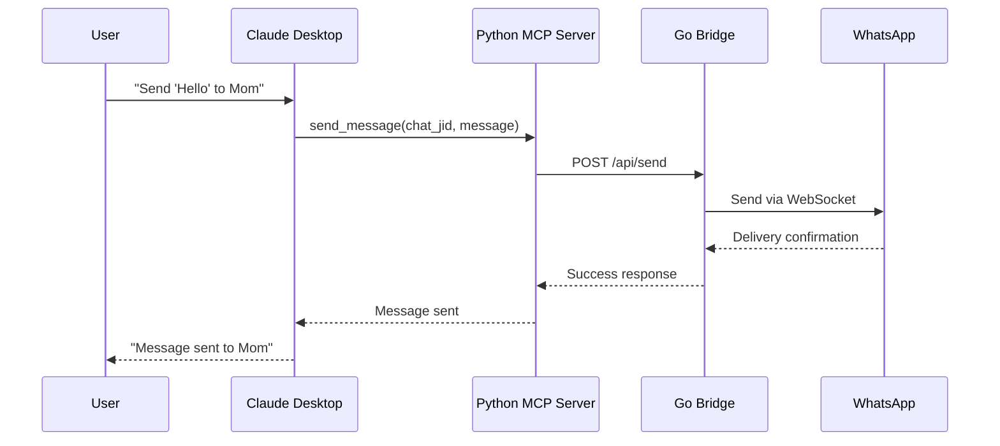
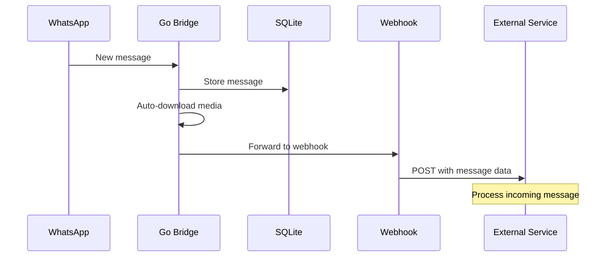

# Architecture

Two processes, two SQLite files, one REST hop. `AGENTS.md` section 3 has the file-by-file map for contributors; this page is the diagram version.


```mermaid
flowchart TB
    subgraph Clients["AI Clients"]
        CD[Claude Desktop]
        CU[Cursor IDE]
        CC[Claude Code]
    end

    subgraph MCP["MCP Layer"]
        PY[Python MCP Server<br/>MCP SDK v2 MCPServer]
    end

    subgraph Bridge["WhatsApp Bridge"]
        GO[Go Bridge<br/>whatsmeow]
        DB[(SQLite<br/>messages.db)]
        WH[Webhook Handler]
    end

    subgraph External["External Services"]
        WA[WhatsApp Web API]
        EXT[External Webhook<br/>Receiver]
    end

    CD & CU & CC -->|MCP Protocol| PY
    PY -->|REST API| GO
    PY -->|Read| DB
    GO -->|Store| DB
    GO <-->|WebSocket| WA
    GO -->|Forward Messages| WH
    WH -->|POST| EXT
```

## Component Details


```mermaid
flowchart LR
    subgraph GoAPI["Go Bridge REST API"]
        direction TB
        SEND["/api/send"]
        READ["/api/mark-read"]
        DOWN["/api/download"]
        REACT["/api/react"]
        TYPE["/api/typing"]
        HIST["/api/history"]
        HEALTH["/api/health, /api/ready, /api/version"]
    end

    subgraph MCPTools["MCP Tools (15 total)"]
        direction TB
        CONT["Contact Tools<br/>search_contacts, get_contact"]
        MSG["Message Tools<br/>list_messages, send_message, etc."]
        CHAT["Chat Tools<br/>list_chats, get_chat, etc."]
        MEDIA["Media Tools<br/>send_file, download_media, etc."]
    end

    MCPTools -->|HTTP Requests| GoAPI
```

The MCP server also serves one **resource** template, `whatsapp://media/{chat_jid}/{message_id}` (both halves percent-encoded): the bytes of one attachment, so a client can fetch a file it saw in a `list_media` row without spending a tool call on it. `resources/read` passes the same gates as `read_media` — chat allow-list, message row, size cap, path proven inside that chat's own media directory, implicit-download policy — see [TOOLS.md](TOOLS.md#reading-media-whatsappmedia).

## Data Flow


```mermaid
sequenceDiagram
    participant User as User
    participant Claude as Claude Desktop
    participant MCP as Python MCP Server
    participant Bridge as Go Bridge
    participant WA as WhatsApp

    User->>Claude: "Send 'Hello' to Mom"
    Claude->>MCP: send_message(chat_jid, message)
    MCP->>Bridge: POST /api/send
    Bridge->>WA: Send via WebSocket
    WA-->>Bridge: Delivery confirmation
    Bridge-->>MCP: Success response
    MCP-->>Claude: Message sent
    Claude-->>User: "Message sent to Mom"
```

## Incoming Message Flow


```mermaid
sequenceDiagram
    participant WA as WhatsApp
    participant Bridge as Go Bridge
    participant DB as SQLite
    participant WH as Webhook
    participant EXT as External Service

    WA->>Bridge: New message
    Bridge->>DB: Store message
    Bridge->>Bridge: Auto-download media
    Bridge->>WH: Forward to webhook
    WH->>EXT: POST with message data
    Note over EXT: Process incoming message
```

### The automatic media download budget

Storing the message row always happens first and never waits for a file. Caching the media is background work with a fixed budget: **four downloads at a time, up to 256 messages waiting**, each bounded by a ten-minute timeout. Shutdown cancels the transfers in flight, discards the backlog and waits for the workers, so a burst of photos can neither open a hundred simultaneous transfers nor keep writing while the databases close.

When the queue is full the arriving message is dropped, not delayed: the bridge logs `Auto-download queue full …` (WARN) and counts it in `whatsapp_bridge_media_autodownload_drops_total`, next to the `whatsapp_bridge_media_autodownload_queued` and `_running` gauges on `/metrics`. Nothing is lost — the message and its media keys are in `messages.db`, so `download_media` (`POST /api/download`) still fetches that file whenever it is actually needed. `WHATSAPP_MEDIA_AUTODOWNLOAD=false` turns the caching off entirely, and `WHATSAPP_MEDIA_MAX_BYTES` still skips files above its threshold before they ever reach the queue.

### The store root

The bridge opens `WHATSAPP_STORE_DIR` once at startup as an [`os.Root`](https://pkg.go.dev/os#Root) and keeps the handle for its whole life. Everything that walks, measures, writes or deletes inside the store — the retention sweep, the `store_bytes` / `media_bytes` measurement behind `/api/health`, `POST /api/media/purge`, the inbound media download (the chat directory, the cache lookup, the `.part` file and its rename) and the read that puts an image into the webhook payload — goes through that handle, so the kernel resolves each path component inside the directory and refuses any that leaves it. A symlink planted in a chat directory (or one swapped in between the check and the syscall) makes the operation fail instead of reaching another file; the databases, the token and the lock at the store root are still skipped by name, as before.

The root keeps an operation inside the store; it does not keep it inside one chat. So the two path components a download builds from message data are checked first: the chat directory (the chat JID) and the file name (which embeds the message ID) must each be a single component — no separator, no `..`, no control character — or the download is refused with a WARN before anything touches the disk. The names of ordinary messages are unchanged. A chat directory or a cached file that is a symlink is not followed even when it points inside the store: the download refuses the directory, and treats the file as not cached and replaces it; the webhook's read refuses both, and sends only bytes whose SHA-256 is the one the message declared (a hard link or a rename needs no symlink), so the payload goes out without `mediaBase64`. Directories the bridge creates in the store, the store itself included, are `0700`; one that already exists keeps its mode.

The rule applies to symlinks an operator put there on purpose too. If a chat directory (`store/<chat_jid>/`) is a symlink onto another disk, a download into it fails (`failed to create chat directory inside the store`), files already there are no longer served from it, the sweep skips it and `/api/media/purge` answers `cached path does not resolve inside the store directory` instead of deleting from it. The same answer is given for a cached name that is itself a symlink, wherever it points: the download, the purge and the webhook decide what is cached with one rule (`media_cache_path.go`), a regular file under a plain name in the chat's own directory. Mount the other disk at the chat directory — or move the whole store with `WHATSAPP_STORE_DIR` — rather than linking into it.

## Timestamps in `messages.db`

Every time column the bridge writes — `messages.timestamp`, `messages.deleted_at`, `chats.last_message_time`, `chats.last_read_time`, `calls.timestamp`, `calls.ended_at`, `polls.created_at`, `poll_votes.voted_at`, `group_members.first_seen`, `group_members.last_seen` — holds one spelling:

```
YYYY-MM-DD HH:MM:SS+00:00        e.g. 2026-09-07 20:10:08+00:00
```

UTC, second resolution, explicit offset, fixed width. SQLite has no date type, so these are TEXT, and the same offset on every row is what makes `ORDER BY timestamp` and `timestamp > ?` compare instants rather than wall clocks — and what lets a bound value seek the index instead of forcing a scan.

Earlier releases bound a `time.Time` and let the SQLite driver render it, which stamped the writing machine's local offset on the row (older stores also hold Go's `time.Time.String()` form). The bridge rewrites those rows to the canonical spelling on startup, logs how many it changed per column, and stamps `PRAGMA user_version` so the rewrite runs once. The stamp is not the whole story: a stamped store still gets one `LIMIT 1` probe per time column at every start, so rows an older binary wrote during an image rollback are repaired on the way forward ([TROUBLESHOOTING.md](TROUBLESHOOTING.md)).

Two things this note does *not* cover: `chats.ephemeral_setting_timestamp` is an INTEGER of WhatsApp seconds, not a time string; and cached media file names keep the *local* wall clock of the message (`<type>_<yyyymmdd_hhmmss>_<id>`), so existing files stay reachable.


## SQLite contention and persistence retries

Live chat/message inserts, decoded poll-message rows, history chat metadata and
outbound chat/message persistence share the Bridge's bounded SQLite BUSY/LOCKED
retry policy: up to three attempts, with 200 ms then 1 s between attempts.
Outbound chat and message upserts use one closure and one budget after WhatsApp
accepted the send; retry never sends a second remote message. Shutdown cancels
all retry waits. Other errors stop immediately. A final failure logs one ERROR
with row identity and increments the counter, including chat rows. A successful
send whose local persistence failed retains success and its message ID, with a
warning that the archive row is unavailable and the message must not be resent.

Under a persistently held writer, the default five-second SQLite busy timeout
plus the shared budget consumes up to 16.2 seconds of lock waits and retry
pauses, instead of separate chat/message budgets. SQL work, media upload, the
remote send and machine scheduling add time; this is not a total-request
latency guarantee. Long history transactions can still delay live writes.

Poll vote tally helpers already use storeLive. Other mutations retain their
own handling: edit/delete bookkeeping, inbound revokes, call rows and auxiliary
message metadata are tracked separately; read/ephemeral state, renamed chats,
refreshed media metadata and group rosters may recover on later updates. Schema
and namespace/time/LID migrations retain their startup error handling. Chat
archive state and retention are not messages.db write paths.
