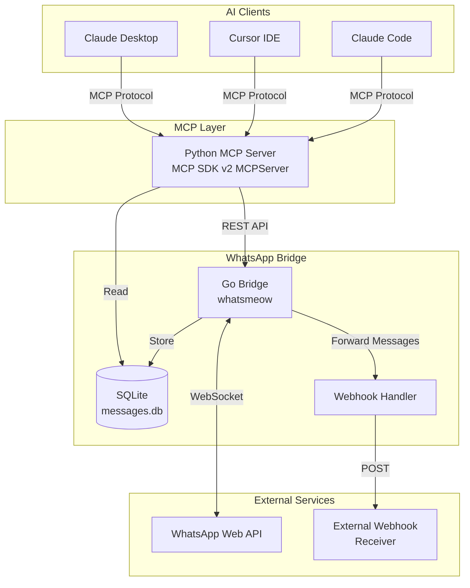
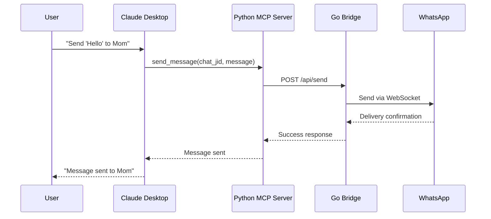
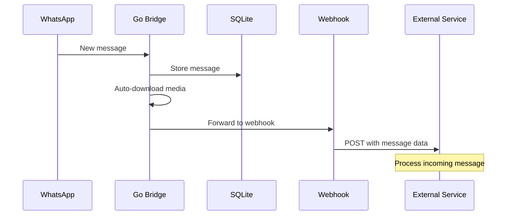

# Architecture

Two processes, two SQLite files, one REST hop. `AGENTS.md` section 3 has the file-by-file map for contributors; this page is the diagram version.


```mermaid
flowchart TB
    subgraph Clients["AI Clients"]
        CD[Claude Desktop]
        CU[Cursor IDE]
        CC[Claude Code]
    end

    subgraph MCP["MCP Layer"]
        PY[Python MCP Server<br/>MCP SDK v2 MCPServer]
    end

    subgraph Bridge["WhatsApp Bridge"]
        GO[Go Bridge<br/>whatsmeow]
        DB[(SQLite<br/>messages.db)]
        WH[Webhook Handler]
    end

    subgraph External["External Services"]
        WA[WhatsApp Web API]
        EXT[External Webhook<br/>Receiver]
    end

    CD & CU & CC -->|MCP Protocol| PY
    PY -->|REST API| GO
    PY -->|Read| DB
    GO -->|Store| DB
    GO <-->|WebSocket| WA
    GO -->|Forward Messages| WH
    WH -->|POST| EXT
```

## Component Details


```mermaid
flowchart LR
    subgraph GoAPI["Go Bridge REST API"]
        direction TB
        SEND["/api/send"]
        READ["/api/mark-read"]
        DOWN["/api/download"]
        REACT["/api/react"]
        TYPE["/api/typing"]
        HIST["/api/history"]
        HEALTH["/api/health, /api/ready, /api/version"]
    end

    subgraph MCPTools["MCP Tools (15 total)"]
        direction TB
        CONT["Contact Tools<br/>search_contacts, get_contact"]
        MSG["Message Tools<br/>list_messages, send_message, etc."]
        CHAT["Chat Tools<br/>list_chats, get_chat, etc."]
        MEDIA["Media Tools<br/>send_file, download_media, etc."]
    end

    MCPTools -->|HTTP Requests| GoAPI
```

The MCP server also serves one **resource** template, `whatsapp://media/{chat_jid}/{message_id}` (both halves percent-encoded): the bytes of one attachment, so a client can fetch a file it saw in a `list_media` row without spending a tool call on it. `resources/read` passes the same gates as `read_media` — chat allow-list, message row, size cap, path proven inside that chat's own media directory, implicit-download policy — see [TOOLS.md](TOOLS.md#reading-media-whatsappmedia).

## Data Flow


```mermaid
sequenceDiagram
    participant User as User
    participant Claude as Claude Desktop
    participant MCP as Python MCP Server
    participant Bridge as Go Bridge
    participant WA as WhatsApp

    User->>Claude: "Send 'Hello' to Mom"
    Claude->>MCP: send_message(chat_jid, message)
    MCP->>Bridge: POST /api/send
    Bridge->>WA: Send via WebSocket
    WA-->>Bridge: Delivery confirmation
    Bridge-->>MCP: Success response
    MCP-->>Claude: Message sent
    Claude-->>User: "Message sent to Mom"
```

## Incoming Message Flow


```mermaid
sequenceDiagram
    participant WA as WhatsApp
    participant Bridge as Go Bridge
    participant DB as SQLite
    participant WH as Webhook
    participant EXT as External Service

    WA->>Bridge: New message
    Bridge->>DB: Store message
    Bridge->>Bridge: Auto-download media
    Bridge->>WH: Forward to webhook
    WH->>EXT: POST with message data
    Note over EXT: Process incoming message
```

### Media lengths and the automatic cache limit

`messages.file_length` is NULL when the message did not declare a length and
0 for an explicitly empty file. `list_messages`, `list_media`, `get_media_notes`
preserve that distinction as JSON null versus 0. The media reader keeps the
declared value distinct internally and reports the actual cached file size
when returning its bytes.

A one-time, transactional `undeclared_media_lengths_v1` marker in
`schema_migrations` changes legacy zeroes to NULL only for the five downloadable
media types, because old rows cannot distinguish the two meanings. Older
non-media zeroes stay untouched, avoiding unnecessary WAL writes. One INFO
reports the changed-row count; later startups leave new explicit zeroes untouched. It updates only the length column, without
rebuilding the content index or scanning media files. Replays keep a known
length when the same plaintext hash arrives without one. The retry SDK has no
length-presence bit: a zero refresh keeps a known length only for that same
plaintext hash, otherwise stores NULL.

Automatic downloads with a nonzero `WHATSAPP_MEDIA_MAX_BYTES` skip undeclared
lengths and reject an oversized declaration. They also bound the streamed
encrypted file (allowing AES padding and its MAC), check decrypted bytes before
publishing the cache file, and remove a rejected temporary file. Manual
downloads remain uncapped; an automatic caller that joins a manual transfer
checks its result without removing the manual cache. In the opposite arrival
order, a manual caller retries without the cap after the rejected automatic
transfer stops and cleans its temporary file, under the same destination lock.

### Structured media headers

Documents, images and videos in a template, buttons or interactive message
header use the same extraction, persistence and download path as top-level
media. The row keeps its URL, direct path, key, both hashes, declared length
and MIME/original document filename/title. Top-level media takes precedence when a
message contains both forms; text-only headers do not invent a media row.

### Replayed media rows

Live messages, history batches and outbound sends share one message upsert. A replay without complete media credentials keeps the stored URL, direct path, key, hashes and length together; it can populate a row that has no media fields yet. A complete snapshot (URL or direct path, key and both hashes) replaces the bundle atomically, including clearing an old direct path for a URL-only snapshot. It also enriches a plain placeholder when the media arrives later.

An incomplete replay keeps the existing media category, filename and timestamp once the row has credentials, so an already cached file remains reachable. A row with no credentials accepts its first partial snapshot with its category, filename and timestamp together; later partial copies cannot mix their fields with it. An incomplete copy with no caption keeps a stored media caption and its searchable content. A complete copy may replace that caption with an empty one.

### The automatic media download budget

Storing the message row always happens first and never waits for a file. Caching the media is background work with a fixed budget: **four downloads at a time, up to 256 messages waiting**, each bounded by a ten-minute timeout. Shutdown cancels the transfers in flight, discards the backlog and waits for the workers, so a burst of photos can neither open a hundred simultaneous transfers nor keep writing while the databases close.

When the queue is full the arriving message is dropped, not delayed: the bridge logs `Auto-download queue full …` (WARN) and counts it in `whatsapp_bridge_media_autodownload_drops_total`, next to the `whatsapp_bridge_media_autodownload_queued` and `_running` gauges on `/metrics`. Nothing is lost — the message and its media keys are in `messages.db`, so `download_media` (`POST /api/download`) still fetches that file whenever it is actually needed. `WHATSAPP_MEDIA_AUTODOWNLOAD=false` turns the caching off entirely, and `WHATSAPP_MEDIA_MAX_BYTES` skips oversized declarations before the queue and bounds actual transfers. These skips are counted in `whatsapp_bridge_media_autodownload_size_skips_total`, with INFO saying that `download_media` still fetches the file. They do not increment the generic download-failure counter.

### The store root

The bridge opens `WHATSAPP_STORE_DIR` once at startup as an [`os.Root`](https://pkg.go.dev/os#Root) and keeps the handle for its whole life. Everything that walks, measures, writes or deletes inside the store — the retention sweep, the `store_bytes` / `media_bytes` measurement behind `/api/health`, `POST /api/media/purge`, the inbound media download (the chat directory, the cache lookup, the `.part` file and its rename) and the read that puts an image into the webhook payload — goes through that handle, so the kernel resolves each path component inside the directory and refuses any that leaves it. A symlink planted in a chat directory (or one swapped in between the check and the syscall) makes the operation fail instead of reaching another file; the databases, the token and the lock at the store root are still skipped by name, as before.

The root keeps an operation inside the store; it does not keep it inside one chat. So the two path components a download builds from message data are checked first: the chat directory (the chat JID) and the file name (which embeds the message ID) must each be a single component — no separator, no `..`, no control character — or the download is refused with a WARN before anything touches the disk. The names of ordinary messages are unchanged. A chat directory or a cached file that is a symlink is not followed even when it points inside the store: the download refuses the directory, and treats the file as not cached and replaces it; the webhook's read refuses both, and sends only bytes whose SHA-256 is the one the message declared (a hard link or a rename needs no symlink), so the payload goes out without `mediaBase64`. Directories the bridge creates in the store, the store itself included, are `0700`; one that already exists keeps its mode.

The rule applies to symlinks an operator put there on purpose too. If a chat directory (`store/<chat_jid>/`) is a symlink onto another disk, a download into it fails (`failed to create chat directory inside the store`), files already there are no longer served from it, the sweep skips it and `/api/media/purge` answers `cached path does not resolve inside the store directory` instead of deleting from it. The same answer is given for a cached name that is itself a symlink, wherever it points: the download, the purge and the webhook decide what is cached with one rule (`media_cache_path.go`), a regular file under a plain name in the chat's own directory. Mount the other disk at the chat directory — or move the whole store with `WHATSAPP_STORE_DIR` — rather than linking into it.

## Timestamps in `messages.db`

Every time column the bridge writes — `messages.timestamp`, `messages.deleted_at`, `chats.last_message_time`, `chats.last_read_time`, `calls.timestamp`, `calls.ended_at`, `polls.created_at`, `poll_votes.voted_at`, `group_members.first_seen`, `group_members.last_seen` — holds one spelling:

```
YYYY-MM-DD HH:MM:SS+00:00        e.g. 2026-09-07 20:10:08+00:00
```

UTC, second resolution, explicit offset, fixed width. SQLite has no date type, so these are TEXT, and the same offset on every row is what makes `ORDER BY timestamp` and `timestamp > ?` compare instants rather than wall clocks — and what lets a bound value seek the index instead of forcing a scan.

Earlier releases bound a `time.Time` and let the SQLite driver render it, which stamped the writing machine's local offset on the row (older stores also hold Go's `time.Time.String()` form). The bridge rewrites those rows to the canonical spelling on startup, logs how many it changed per column, and records its independent `canonical_timestamps_v1` marker in `schema_migrations` once every value was converted. Legacy `user_version` stays untouched; another rewrite cannot mark this one complete or cause it to be skipped. The stamp is not the whole story: a stamped store still gets one `LIMIT 1` probe per time column at every start, so rows an older binary wrote during an image rollback are repaired on the way forward ([TROUBLESHOOTING.md](TROUBLESHOOTING.md)).

Two things this note does *not* cover: `chats.ephemeral_setting_timestamp` is an INTEGER of WhatsApp seconds, not a time string; and cached media file names keep the *local* wall clock of the message (`<type>_<yyyymmdd_hhmmss>_<id>`), so existing files stay reachable.


## Forwarded media presentation

`messages.media_presentation` holds a bounded JSON object with the plaintext
file SHA256 and validated original MIME,
document name/title, audio PTT/duration/waveform, and sticker animation. Live,
history-batch and outbound writes insert it with the credentials through the
shared upsert. Incomplete replays keep the snapshot; complete writes with the
same plaintext hash merge supplied fields and keep omitted ones. A changed hash
starts a new presentation. On read, JSON whose stored hash differs from the
row's file hash is ignored, including after an older image replays a new file
without updating the JSON. Invalid/wrongly typed JSON falls back to legacy
forwarding with one bounded DEBUG line per discarded read; the upsert replaces
invalid objects instead of passing them to `json_patch`.
The sender checks a valid presentation's hash against the actual cached bytes
before upload and again at message construction; a mismatch refuses forwarding.
Bounded document names retain their safe extension so replay does not change
the existing cache identity used by download and purge.

Validation runs at ingress and the wire sink: names/titles share the outbound
display sanitizer (controls/bidi removed, 200 characters and safe extension
retained; punctuation stays). Wire filenames additionally remove paths and
filesystem punctuation. The
waveform is exactly 64 bytes, seconds is within 0–86400, and MIME is a whitespace-
and parameter-free type/subtype permitted for that category, except the exact
`audio/ogg; codecs=opus` audio MIME (WebP only for
stickers, audio/* for audio, any well-formed document type). Invalid fields are
dropped. The LID-to-phone row copy keeps presentation and direct path together.

Structured headers become media only with a URL/direct path and a key;
thumbnail-only headers stay text. Template Format variants retain their body,
and a header document caption supplies text when the body is empty. The shared
extractor uses the SDK's envelope order for live and history: device-sent,
bot-invoke, ephemeral, view-once variants, Lottie, document-with-caption and
edited. Wrapper context is inherited on a local view without mutating the
SDK-owned payload.

The forward handler reads category, name and presentation together and reloads
them after retrieval, since a phone retry can refresh the row. A changed retry
hash clears the old presentation; ordinary retries preserve it. These values
reach the sender under the same request deadline. The outgoing
protobuf supplies the category/presentation of the newly archived outbound row.

Startup adds one nullable column through `ensureColumn`, without rewriting old
rows or changing migration markers. Existing Python readers ignore this column;
MCP forwarding continues to call the bridge. Old rows use the documented legacy
fallback in [TOOLS.md](TOOLS.md#forward_message), and cache names remain intact.
Legacy Ogg Opus is forwarded as a voice note with computed duration/waveform;
modern Opus rows retain their PTT and compute only missing duration/waveform.
New unnamed inbound documents keep an empty filename, shown as null by MCP;
outbound `/api/send` rows retain their actual wire presentation too. The JSON
column itself is not exposed by MCP readers or webhooks.

## SQLite contention and persistence retries

Live chat/message inserts, decoded poll-message rows, history chat metadata and
outbound chat/message persistence share the Bridge's bounded SQLite BUSY/LOCKED
retry policy: up to three attempts, with 200 ms then 1 s between attempts.
Outbound chat and message upserts use one closure and one budget after WhatsApp
accepted the send; retry never sends a second remote message. Shutdown cancels
all retry waits. Other errors stop immediately. A final failure logs one ERROR
with row identity and increments the counter, including chat rows. A successful
send whose local persistence failed retains success and its message ID, with a
warning that the archive row is unavailable and the message must not be resent.

Under a persistently held writer, the default five-second SQLite busy timeout
plus the shared budget consumes up to 16.2 seconds of lock waits and retry
pauses, instead of separate chat/message budgets. SQL work, media upload, the
remote send and machine scheduling add time; this is not a total-request
latency guarantee. Scheduling and repeated writer acquisition can still delay live writes.

Poll vote tally helpers already use storeLive. Edit/revoke/read-receipt archive bookkeeping,
inbound revokes and call lifecycle rows also use the Bridge retry owner. The
remote edit or revoke runs once before its local retry closure; exhaustion
keeps the successful remote response with an archive warning and records one
failure with its row identity. Their local lock waits and retry pauses can add
about 16 seconds after the remote effect, using the same single budget as send.
Live message rows and their direct path,
mentions, poll and view-once metadata commit together in one transaction, so
an auxiliary failure cannot leave a partial row or FTS entry. A non-busy
auxiliary failure now drops the whole live row, logs ERROR, increments the
failure counter and makes a forwarded webhook report `stored:false`.
All messages.db transactions are write transactions and acquire the writer at
BEGIN IMMEDIATE, before the FTS triggers can encounter a deferred lock upgrade.
RenameChat also uses the shared retry owner.

Other mutations retain their own handling: inbound read/ephemeral state,
refreshed media metadata and group rosters may recover on later updates. Schema
and namespace/time/LID migrations retain their startup error handling. Chat
archive state and retention are not messages.db write paths.

History imports commit at most 500 input envelopes per transaction, using a
prepared insert within each chunk. A live event can write after a committed
chunk; a large conversation no longer owns one continuous write transaction.
BUSY/LOCKED retries repeat the whole chunk, and metrics count only committed
rows. A row or side-table failure aborts the chunk and prevents later statements
from silently autocommitting after a SQLite rollback. Earlier
committed chunks remain. Non-busy failures replay that chunk atomically one row
at a time, so one bad row costs one row. Exhausted BUSY/LOCKED stops that
conversation at the newest committed prefix, keeping the history-request
anchor in front of the unimported range. One ERROR names the chat, row count
and first/last missing IDs; the failure counter counts ROWS, not ERROR lines.
A chat-row failure skips its conversation and counts its importable messages
once. Shutdown stops between chunks/conversations with one INFO, without
counting unattempted rows as failures.

The temporary-file benchmark `BenchmarkHistoryLiveWriteFile` runs the actual
history and live handlers with 5,000 history messages, a concurrent live message
and FTS enabled, and checks rows, index entries and metrics. Its transaction
and live-wait timings depend on the machine and load; chunking bounds the input
count per transaction rather than guaranteeing a latency or writer fairness.
